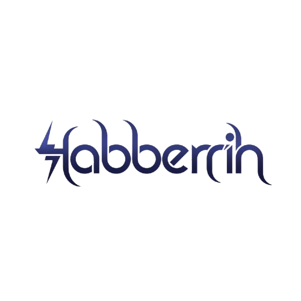

# 👋 Hi, I'm a Backend Developer

  

I design and build reliable APIs, event‑driven services, and data workflows, with a focus on performance, maintainability, and a clean developer experience. A Computer Science Graduate with expertise in AI research, NLP, and backend development, I specialize in building robust APIs, orchestrating AI agents with LangGraph and LangChain, and conducting research in sentiment analysis of Arabic dialects.

## Overview

- Orchestrating AI agent workflows with LangGraph.js and LangChain
- Practical experience with NestJS, Laravel, FastAPI, and Flask
- Interested in scalable backends, data pipelines, and developer tooling
- Open to collaborating on impactful backend projects

## 💻 What I Do

- AI agent orchestration: LangGraph.js, LangChain, multi-agent workflows
- APIs and microservices: Node.js, NestJS, Laravel, FastAPI, Flask
- Data processing and ML prototyping: Python, Pandas, scikit‑learn
- Datastores: Postgres, MySQL/MariaDB, MongoDB, Redis, Prisma ORM
- DevOps and tooling: Docker, Nginx, GitHub Actions, Terraform, Jenkins, Postman, Swagger

## 🌐 Socials

## 🧰 Tech Stack

**Languages**

**Frameworks & Runtimes**

**Data & Databases**

**DevOps & Tooling**

## GitHub Stats

  
  

  

---

📫 Check my: [Portfolio](https://habberrih.ly)
